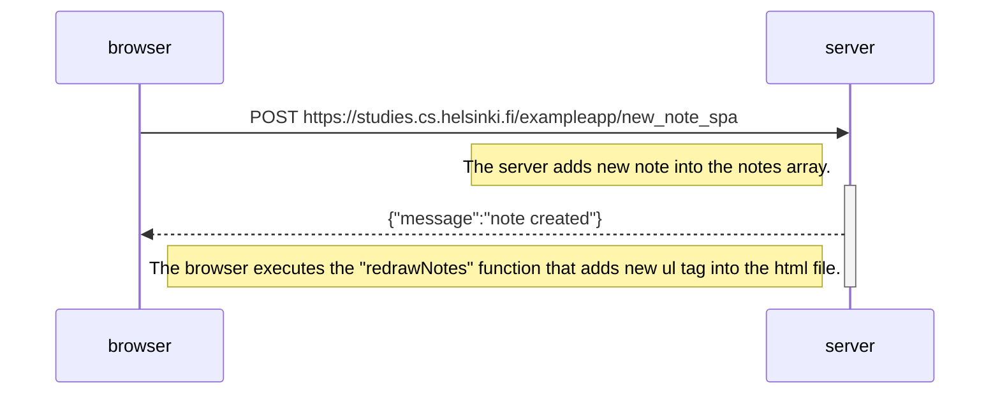

# Exercise 0.6

```mermaid
sequenceDiagram
    participant browser
    participant server

    browser->>server: POST https://studies.cs.helsinki.fi/exampleapp/new_note_spa
    Note left of server: The server adds new note into the notes array.
    activate server
    server-->>browser: {"message":"note created"}
    Note right of browser: The browser executes the "redrawNotes" function that adds new ul tag into the html file.
    deactivate server
```